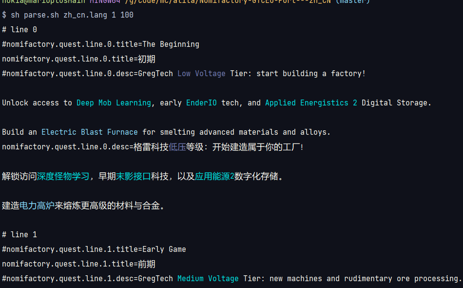

# Nomifactory-GTCEu-Port---zh_CN

基于[nomi-ceu](https://github.com/tracer4b/nomi-ceu) / [Nomifactory (GTCEu Port)](https://www.curseforge.com/minecraft/modpacks/nomi-ceu) 的深度汉化，汉化内容包括：

- 任务书
- 部分mod物品

# parse.sh

一个辅助查看语言文件的颜色效果的脚本

## 使用方法

```shell
sh parse.sh lang文件地址 开始的行数 结束的行数
```

例如查询 zh_cn.lang 1-100 行的效果

```shell
sh parse.sh zh_cn.lang 1 100
```


